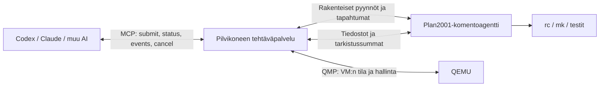

# Keskustelu: AI-etäkäyttö, 9P, 2001P ja drawterm

Päivä: 30.9.2026.

Tämä on käyttäjälle näkyvän keskustelun sisältötallenne. Mukana ovat
käyttäjän pyynnöt ja avustajan vastaukset; työkalujen raakaviestit,
ympäristön metadata ja välivaiheiden tilapäivitykset on jätetty pois.
Sanamuotoja ja muotoilua on toimitettu Markdown-tallennetta varten.
Loppuosan laajat avustajan vastaukset on merkitty tiivistelmiksi; täydentävät
tekniset muistiot ovat erillisissä tiedostoissa tässä hakemistossa.
Salasana on poistettu ja muistioiden linkit muutettu repossa toimiviksi.
Keskustelun aiemmat ehdotukset säilyvät historiallisina: viimeisin tilanne
ja myöhemmät tarkennukset löytyvät [jatkomuistiosta](README.md).

## 1. Pääsy projektiin

**Käyttäjä:** pääsetkö käsiksi plan2001 projektiin

**Avustaja:** Kyllä, pääsen käsiksi GitHub-projektiin
[pereuna/Plan2001](https://github.com/pereuna/Plan2001). Minulla on siihen
luku- ja kirjoitusoikeudet. Projektia ei vielä ole ladattu tähän työympäristöön.

## 2. AI:n, pilven ja QEMU:n kommunikoinnin suunnittelu

**Käyttäjä:** suunnittele AI ystävällinen tapa kommunikointiin ja tiedonsiirtoon AI ja pilvipalvelu ja qemu välille. nyt kommunikaatio on huonoa. AI ajaa käskyjä timeoutilla ja jos on pieni virhe niin odotetaan 10min. mikä tähän on paras tapa. verbose komennot Plan2001, komento-status-paluuarvo kanavat, ssh tyyppinen kommunikointi vai clauden, codexin, muun AI porttaaminen to plan2001

**Avustaja:** Suosittelen pysyvää tehtäväpalvelua pilvikoneelle, pientä
komentoagenttia Plan2001:een ja AI:lle yhteistä MCP-rajapintaa. Komennot
käynnistetään tehtävinä, joiden tilaa, tulostetta ja tuloksia voi lukea
erikseen. Claudea tai Codexia ei tarvitse portata Plan2001:een.

Nykyisestä koodista löytyi konkreettinen syy odotteluun:

- `tools/9run` kerää tavallisen komennon tulosteen muistiin ja näyttää sen vasta lopetusmerkin tai timeoutin jälkeen.
- Komennon valmistuminen tunnistetaan samasta sarjakonsolista luettavalla tekstimerkillä. Kadonnut syöte tai shellin jumi voi jättää merkin tulematta.
- Timeout palauttaa `124`, mutta ei keskeytä vieraskoneessa ajettavaa komentoa.
- `tools/build.sh` käyttää oletuksena 900 sekunnin timeoutia. Sen `tee` ei saa reaaliaikaista tulostetta, koska `9run` puskuroi sen.

Verbose auttaa havainnointiin, mutta varsinainen korjaus on erottaa
tehtävän elinkaari terminaalitulosteesta.



QEMU on tässä koneen hallintakerros. QMP kertoo virtuaalikoneen tilan;
vieraskoneen agentti kertoo komennon tilan. Sarjakonsoli säilytetään
käynnistyksen, asennuksen ja vikatilanteiden diagnostiikkaan.

AI:lle pieni, vakaa työkalurajapinta:

| Työkalu | Tehtävä |
|---|---|
| submit | Validoi ja käynnistä tehtävä; palauta heti job_id |
| status | Palauta nykyinen tila, vaihe ja mahdollinen virhe |
| events | Lue uudet tapahtumat annetusta kohdasta; odota enintään esimerkiksi 20 s |
| cancel | Pyydä keskeytys ja raportoi, onnistuiko se |
| upload / download | Siirrä lähteet ja tulokset tarkistussummilla |

AI:n työkalukutsun kesto ja komennon suoritusaika ovat erillisiä.
Käännös saa kestää 15 minuuttia, mutta AI saa tehtävätunnuksen heti ja
voi lukea välituloksia.

```json
{"job_id":"j42","state":"running","phase":"compile","last_seq":18}
```

Virheen jälkeen:

```json
{"job_id":"j42","state":"failed","error_kind":"command_failed","guest_status":"mk: errors","last_seq":24}
```

Plan 9:n merkkijonomuotoinen `$status` säilytetään sellaisenaan. Lisäksi
rajapinta antaa yhdenmukaisen onnistumis- tai virhetilan. Yhteyden
katkeaminen raportoidaan erikseen: se ei todista, että komento epäonnistui
tai pysähtyi.

Kolme loogista kanavaa:

1. Ohjaus ja tila: käynnistys, hyväksyntä, valmistuminen, keskeytys ja heartbeat. Jokaisessa viestissä tehtävätunnus; tapahtumissa järjestysnumero. Näitä ei päätellä vapaamuotoisesta lokista.
2. Tuloste ja edistyminen: stdout, stderr ja vaiheviestit näkyvät heti. AI saa lyhyen tilan ja rajatun lokiotteen; koko loki tallennetaan. Verbose näyttää lisätiedot ja JSON koneellisen muodon.
3. Tiedostot: lähdekoodi, binäärit ja suuret lokit siirtyvät tiedostoina. Siirto väliaikaiseen kohteeseen, koon ja SHA-256:n tarkistus, julkaisu vasta lopuksi. in.img/out.img voivat säilyä verkkoyhteydettömän buildin siirtotapana.

Kanavat voivat kulkea yhden yhteyden sisällä erillisinä viestityyppeinä.
Kolmea erillistä verkkoyhteyttä ei tarvita.

Pitkät turhat odotukset poistuvat näin:

- Ennakkotarkistus: puuttuva tiedosto, väärä kohde tai kuollut VM palauttaa virheen ennen suoritusta.
- Käynnistyskuittaus: agentin pitää kuitata aloitus esimerkiksi viidessä sekunnissa.
- Heartbeat: agentti ilmoittaa elossaolostaan esimerkiksi kahden sekunnin välein. Hiljainen käännös voi silti olla terve.
- Valmistumisviesti: prosessin päättyminen tuottaa heti rakenteisen tuloksen, myös virheessä.
- Erillinen suoritusaikaraja: pitkä raja koskee itse tehtävää. Sen ylittyessä aloitetaan keskeytys ja odotetaan kuittausta.
- Yhteyden palautuminen: samalla tehtävätunnuksella jatketaan seurantaa. Komentoa ei käynnistetä uudelleen pelkän yhteyskatkon vuoksi.

Keskeytyksen pitää kohdistua tehtävän prosesseihin ja lapsiprosesseihin.
Jos keskeytystä ei voida vahvistaa, tila on unknown; seuraavaa komentoa
ei lähetetä sokkona samaan konsoliin. Sarjakonsolia käyttävät tehtävät
lukitaan niin, että vain yksi kirjoittaa kerrallaan.

| Vaihtoehto | Suositus |
|---|---|
| Verbose-komennot | Toteuta heti, yhdessä rakenteisen tilan kanssa |
| Komento–status–tulos-kanavat | Ratkaisun ydin |
| SSH | Hyvä suojattu yhteys pilvikoneelle; tarvitsee silti tehtäväpalvelun |
| Plan 9:n 9P/rcpu | Luonteva vieraskoneen yhteys; hyödynnä nykyistä tukea |
| Claude/Codex Plan2001:een | Ei ensimmäiseksi: porttaus ei ratkaise komentojen seurantaa |

Plan2001:een sopisi esimerkiksi 9P-palvelu:

```text
/jobs/j42/ctl
/jobs/j42/status
/jobs/j42/events
/jobs/j42/stdout
/jobs/j42/stderr
/jobs/j42/artifacts/
```

Pilvikoneen sovitin muuntaa tämän MCP-työkaluiksi. Sama rajapinta palvelee
eri AI-tuotteita. Vieraskoneen yhteys voidaan toteuttaa ensin nykyisen
kuljetuksen päälle ja myöhemmin autentikoidun verkkoyhteyden kautta.
Nykyistä TCP-avaimeen perustuvaa konsolia ei pidä sellaisenaan avata
julkiseen internetiin.

Toteutusjärjestys:

1. Korjaa 9run: reaaliaikainen tuloste, yhteyden ja relay-prosessin tarkistus, yhden komentajan lukitus ja selkeä timeout-tila.
2. Lisää pilvikoneelle pysyvä tehtäväpalvelu: tehtävätunnukset, tallennettu tila, tapahtumaloki ja lyhyet seurantakutsut.
3. Lisää Plan2001-agentti: valmistumiskuittaus, heartbeat, prosessien keskeytys ja tiedostosiirto.
4. Lisää MCP-sovitin ja QMP-pohjainen VM-valvonta.

Hyvä hyväksymistesti: virheellinen komento palauttaa virheen sekunneissa,
pitkä hiljainen käännös näkyy elävänä, ja yhteyskatkon jälkeen saman
tehtävän seuranta jatkuu ilman uutta suoritusta. Tämä oli koodiin
perustuva suunnitelma; muutoksia tai ajoja QEMU:ssa ei vielä tehty.

## 3. Pilvipalvelun saavutettavuus

**Käyttäjä:** pääsetkö pilvipalveluun käsiksi, älä muuta mitään mutta voit testata salasana on [SALASANA POISTETTU]

**Avustaja:** En vielä pystynyt vahvistamaan pääsyä pilvipalveluun.
Löysin osoitteen https://term.cpu.plan2001.com/, mutta tämän työympäristön
verkkoproxyyn yhdistäminen epäonnistuu, joten testi ei päässyt palvelimelle asti.
Salasanaa en ehtinyt testata. En muuttanut pilvipalvelussa mitään.
Dokumentaation mukaan hallinta kulkee HTTPS:n ja Monolith-terminaalin
kautta; SSH ei ole käytössä. Kun työympäristön verkkoyhteys toimii, voin
kokeilla kirjautumista ja lukea koneen tilan.

## 4. Mikä työympäristö?

**Käyttäjä:** "työympäristön" mitä tämä tarkoittaa

**Avustaja:** Tarkoitan väliaikaista Linux-konetta, jossa minä ajan
komentoja tässä keskustelussa. Sen työhakemisto on `/workspace`.
Se on eri kone kuin sinun Plan2001-pilvipalvelimesi.

Tämän koneen verkkoyhteys kulkee välityspalvelimen eli proxyn kautta.
Yhteys siihen epäonnistui, joten pyyntöni ei päässyt Plan2001-palvelimelle
asti. Testi ei siis kerro, onko sinun palvelimesi toiminnassa tai salasana oikein.

## 5. HTTPS-komentorajapinta

**Käyttäjä:** jos https kutsujen parametereina autentikoinnin jälkeen voisi ajaa komentoja plan2001 pilvikoneessa saisitko suoraan yhteyden

**Avustaja:** Kyllä, autentikoitu HTTPS-komentorajapinta antaisi minulle
suoran tavan ajaa komentoja Plan2001:ssä ilman selainta. Nykyisen
työympäristön proxyongelma täytyy silti korjata: se estää nyt myös
tavalliset HTTPS-kutsut.

Suosittelen komentojen lähettämistä POST-pyynnön JSON-rungossa, ja
tunnistautumista Authorization-otsakkeella. Salasanaa tai komentoja ei
kannata laittaa URL-parametreihin, koska URL:t voivat tallentua lokeihin.

```http
POST /api/jobs
Authorization: Bearer <token>
Content-Type: application/json

{"command":"cat /dev/sysname","timeout_seconds":10}
```

Palvelin palauttaisi heti tehtävätunnuksen:

```json
{"job_id":"42","state":"running"}
```

Sen jälkeen käyttäisin GET /api/jobs/42 tilaan ja paluuarvoon,
GET /api/jobs/42/events?after=0 uusiin tulosteisiin ja
POST /api/jobs/42/cancel keskeytykseen.

Tämä poistaisi headless Chromiumin, näppäimistön simuloinnin ja tulosten
välittämisen julkisen väliaikaistiedoston kautta. Se olisi hyvä ensimmäinen
toteutus aiemmin ehdottamalleni tehtäväpalvelulle.

## 6. Term-sivua ei vielä saavuteta

**Käyttäjä:** eli et nyt pysy saavuttamaan edes term sivua?

**Avustaja:** Kyllä, en tällä hetkellä pääse edes term-sivulle. Yhteys
epäonnistuu oman työympäristöni proxyyn ennen kuin pyyntö saavuttaa
palvelimesi. En siis ole voinut testata kirjautumista.

## 7. Verkkoyhteys alkaa toimia

**Käyttäjä:** päseetkö nyt

**Avustaja:** Kyllä, nyt pääsen term-sivulle: https://term.cpu.plan2001.com/
palauttaa HTTP 200, ja TLS-varmenne kelpaa.
Kirjautumista en vielä testannut. Palvelimella en muuttanut mitään.

## 8. Kirjautumiskoe

**Käyttäjä:** kokeile kirjautua

**Avustaja:** Kirjautuminen onnistui glenda-käyttäjänä antamallasi
salasanalla. Plan 9 -konsoli avautui ja näytti `cpu%`-komentokehotteen.
En ajanut komentoja tai muuttanut palvelimen tiedostoja. Suljin testiyhteyden.

## 9. Acmen käännöskoe

**Käyttäjä:** voitko kääntää esim acme koneella testiksi

Avustaja aloitti käännöskokeen erillisessä väliaikaishakemistossa.
Kokeen aikana tuli seuraava käyttäjän viesti. Käännöksen vahvistettu
tulos kerrottiin seuraavan kohdan vastauksessa.

## 10. Kaksisuuntainen yhteys ilman kuvakaappauksia

**Käyttäjä:** claude ajaa kaksisuuntaista term yheyttä koneeseen ilman screenshotteja, selvitä miten

**Avustaja:** Kaksisuuntainen tekstiyhteys onnistuu myös minulta ilman
kuvakaappauksia. Testasin sen nyt.

Yhteys toimii näin:

1. Headless Chromium kirjautuu Monolithiin.
2. Komennot lähetetään window.monolith.push-näppäintapahtumina.
3. Paluuteksti luetaan suoraan wss://term.cpu.plan2001.com/rcpu-yhteyden 9P Twrite -viesteistä, jotka kohdistuvat konsolin cons-tiedostoon.

Tämä ei tarvitse kuvantunnistusta eikä julkisia väliaikaisia
tulostiedostoja. Clauden tarkkaa toteutusta en näe, mutta tämä tapa
toimii samalla palvelimella.

Samalla varmistui Acmen käännöstulos:

```text
6.out: amd64 plan 9 executable
```

Binääri on 501810 tavua, polussa `/tmp/acme-ai-test-20260930/6.out`.
Käännös onnistui; en asentanut sitä järjestelmän Acmen päälle.
Testiskripti oli keskustelun työympäristössä
`/workspace/scratch/term-text-verified.py`; sitä ei tallenneta tähän repoon.


## 11. Chromiumin poistaminen komentopolusta

**Käyttäjä:** minusta headless chromium tässä kuulostaa jotenkin ylimääräiseltä. suunnittele tehokkaampi tapa

**Avustajan vastaus (tiivistetty):** Chromium on ylimääräinen kerros. Se ajaa
nykyisessä toteutuksessa selaimeen käännettyä drawtermia, joka hoitaa
9P:n ja tunnistautumisen; pelkkä WebSocket-asiakas ei siis korvaa kaikkea.
Ehdotus oli pieni natiivi komentopalvelu Plan2001:een ja HTTPS-asiakas
AI:n koneelle. Palvelu tarjoaa submit/status/events/input/cancel- ja
tiedostosiirron, erillisen prosessin putkilla ja pysyvän tehtävätunnuksen.
Long polling riittää ensimmäiseen versioon; WebSocket sopii interaktiiviseen
terminaaliin. Toinen vaihtoehto on natiivi drawterm/rcpu-asiakas nykyisen
WSS-yhteyden päälle. Tässä vaiheessa avustaja suositteli ensin
HTTPS-tehtävärajapintaa; myöhemmin suositusta tarkennettiin 9P:n suuntaan.

## 12. Miksi 9P ja miksi WSL käyttää sitä?

**Käyttäjä:** onko 9p protokollassa jotain erityistä säilytettävää vai onko se legacy hack. miksi windows valitsi sen wsl tiedostojakoon?

**Avustajan vastaus (tiivistetty):** 9P:n säilyttämisen arvoinen idea on
etäresurssien tarjoaminen tiedostoina samassa nimiavaruudessa. Se on
Plan 9:n perusrakenne, ei pelkkä legacy-hack. Protokolla välittää
open/read/write/walk-operaatioita; palvelu määrittelee niiden merkityksen.
Esimerkiksi /jobs/42/ctl, status, stdout ja stderr voivat tarjota
tehtävärajapinnan. 9P ei itse määrittele tehtävän aikarajoja tai uusintaa.

WSL 2:n tiedostopääsyssä 9P on käytännöllinen, suhteellisen pieni
käyttöjärjestelmien välinen tiedostoprotokolla, jolle Linuxissa oli jo tuki.
Tämä ei lupaa parasta suorituskykyä: paljon pieniä tiedosto-operaatioita
Windows/Linux-rajan yli voi olla hidasta. Myös tiedostojärjestelmien
semantiikan sovittaminen ja viive vaikuttavat. Plan2001:n sisäinen 9P ja
AI:lle tarjottava HTTPS-sovitin voivat käyttää samaa tehtäväpalvelua.

## 13. Miksei natiivia Linuxin 9P-tukea käytetä?

**Käyttäjä:** Miksi ei Claude ole asentanut suoraan allaan olevaan, siis Claude-kode, allaan olevaan Linuxiin N9P-palvelua? Miksi se käyttää draft-termiä? Koska Linuxissa on N9P-palvelu mahdollisuus. Miksi ei sitä käytetä suoraan? Miksi et sinä käytä sitä suoraan?

**Avustajan vastaus (tiivistetty):** Suora natiivi yhteys olisi ollut
järkevä selvittää ennen Chromiumia. Avustaja käytti projektin dokumentoitua
selainreittiä eikä ensin selvittänyt kevyempää vaihtoehtoa. Clauden
valinnan syytä ei tiedetä.

Linuxin 9P-asiakas liittää tiedostopalvelun, mutta ei yksin käynnistä
etäkomentoja. Linuxin 9P-palvelin puolestaan jakaisi Linuxin resursseja.
Drawterm/rcpu hoitaa myös tunnistautumisen ja etäistunnon. Nykyinen
WSS /rcpu -reitti ei ole tavallisen Linuxin 9P-mountin suora päätepiste.
Natiivi Linux-ohjelma voi kuitenkin toteuttaa saman WSS/auth/rcpu/9P-ketjun
ilman Chromiumia. Suositusta korjattiin: ensin kannattaa tutkia natiivin
asiakkaan sovittaminen nykyiseen yhteyteen; pysyvä tehtäväseuranta on
sen päälle erillinen parannus.

## 14. 2001P-protokollan suunnittelu

**Käyttäjä:** suunitellaan 2001P protokolla. liikenne mahdollisimman binäärisenä, kohteessa tietokantapalvelin jolla on exec oikeus ja worker pool joka toimii kohdekoneessa myös rinnakkaisena. etäkoneen pyynnöt kohdekoneen tietokannassa jäävät suoritukseen vaikka yhteys pätkii. base komennot ehkä binääreinä isolla verbosella suoraan kantaan. erityisesti tilastolliset yleisimmät AI komennot

**Avustajan vastaus (tiivistetty):** 2001P kannattaa rakentaa pysyvän
tehtäväkannan ympärille. Etäkone jättää tehtävän, saa tunnuksen ja seuraa
tulosta. Yhteys voidaan vaihtaa ilman, että tehtävä muuttuu.
Kirjoitettiin [2001P v0.1 -luonnos](2001p-v0.1.md).

Osat: 2001pd, tehtäväkanta, ajoittaja/supervisor, paikalliset workerit,
tapahtumaloki ja artefaktivarasto. Käynnistysvaltuus on supervisorilla;
asiakas lähettää hyväksytyn tyypitetyn operaation. Nykyinen crsrv tarjoaa
muistissa olevan jonon ja kapasiteettiseurannan.

Binäärinen siirto: 32 tavun otsake, CBOR-ohjaus numeroiduilla kentillä,
raakadatana siirtyvät tiedostolohkot ja erilliset loogiset kanavat.
Sama sovellusprotokolla voi kulkea TLS/TCP:n tai WSS:n päällä. Natiivi
WSS-asiakas ei tarvitse selainta.

ACCEPTED lähetetään vasta pysyvän commitin jälkeen. submission_key
estää saman pyynnön käynnistämisen kahdesti kadonneen kuittauksen vuoksi.
WATCH jatkuu tapahtumasekvenssistä. Verkkokatko ei muuta suoritusta.
Koneen uudelleenkäynnistys säilyttää tehtävätiedot, mutta ei mielivaltaisen
prosessin muistia. Turvalliset operaatiot voidaan uusia; yleiselle
EXECille ei luvata exactly-once-sivuvaikutuksia.

Paikallinen pooli erottaa kevyet I/O-operaatiot käännöksistä ja testeistä.
Resurssibudjetit ja workspace-lukot estävät hallitsemattoman rinnakkaisuuden.
Tyypitettyjä base-operaatioita: FS_LIST/STAT/READ, TEXT_SEARCH,
REPO_STATUS/DIFF, FILE_PATCH, BUILD/TEST ja EXEC. Ne voivat aluksi käyttää
olemassa olevia binäärejä adaptereilla. Rakenteinen verbose tallentuu,
mutta AI saa oletuksena rajatun otteen ja jatkokursorin.

Yleisimmät AI-komennot olivat hypoteesi, eivät mitattu järjestys.
Ehdotettiin oman käyttötilaston keräämistä: kutsumäärät, kokonaistehtävän
kutsukierrokset, jonotus/suoritusaika, p50/p95, virheet ja siirretyt tavut.
Ensimmäinen hyväksymiskoe: yhteys katkeaa Acme-buildissa, työ jatkuu,
ja sama tulos löytyy uudelleen yhdistämisen jälkeen.

## 15. Etä-fork ja 9P

**Käyttäjä:** miten 9P tekee fork etänänä kohdekoneella

**Avustaja:** 9P ei itsessään tee etä-forkia. Se välittää tiedosto-operaatioita.
Kohdekoneen palvelu voi tulkita kirjoituksen pyynnöksi käynnistää prosessin.
Asiakas kirjoittaa /jobs/submit-tiedostoon; 9P lähettää Twriten;
paikallinen tehtäväpalvelu tallentaa työn; worker tekee rfork + execin;
asiakas lukee tehtävän tilaa ja tulostetta. Merkitys tulee palvelun
rajapinnasta, ei 9P:n fork-komennosta.

Drawterm/rcpu:ssa CPU-palvelimen istuntopalvelu hoitaa prosessin
käynnistämisen. 9P antaa etäprosessille pääsyn asiakkaan tarjoamiin
resursseihin. 2001P:ssä 9P voi tarjota /jobs-näkymän, pysyvä palvelu
hoitaa ajot ja paikallinen pooli rforkit.

## 16. Onko natiivia CLI-etäkäyttöä?

**Käyttäjä:** 2001p md on hyvä pohja. pitäisikö kuitenkin laittaa 9p ensin toimivaksi? onko niin ettei Plan9 sisällä natiivia cli pohjaista etäkäyttöä? onko ajateltu että drawterm gui on ainoa rajapinta. miten cpu palvelimen ja fs palvelimen välinen kommunikaatio toimii?

**Avustajan vastaus (tiivistetty):** Natiivi CLI-yhteys kannattaa saada
ensin toimimaan nykyisen 9P/rcpu-rakenteen päälle. 9P toimii Plan2001:ssä
jo; puuttuva osa on Linux-ympäristön sujuva pääsy ilman selainta.
Avustajan aiempi suositus uuden rajapinnan rakentamisesta oli liian varhainen.

Plan 9:ssa on cpu, 9frontissa rcpu ja muille käyttöjärjestelmille natiivi
drawterm -G. GUI ei ole edellytys. Repon drawterm tukee myös -c:tä.
Nykyinen webterm ohittaa asiakkaan käynnistysskriptin ja ajaa palvelimen
määräämän sovelluksen, joten -c:tä ei voi olettaa toimivaksi muuttamatta
nykyisen WSS-reitin käyttöä.

CPU-palvelin ajaa prosessit; FS-palvelin vastaa 9P-tiedosto-operaatioihin.
CPU-koneen kernel käyttää prosessin nimiavaruuden mountteja muuntaessaan
open/read/write-kutsut 9P-viesteiksi. Kääntäjä suoritetaan CPU-koneella,
vaikka lähteet ja ohjelmabinäärit luetaan FS-palvelimelta. CPU ja FS voivat
olla samassa koneessa; pilvikuvan dokumentaatio kuvaa paikallista cwfs:ää.
Drawterm tarjoaa myös asiakkaan resurssit CPU-palvelimelle /mnt/term:iin.

Ehdotettu järjestys: natiivi tekstiasiakas, stdin/stdout/paluuarvon ja
tiedostopääsyn varmennus, pysyvä 9P /jobs -palvelu, ja oman 2001P-
siirtoprotokollan arviointi mittausten perusteella. Pysyvä tehtävämalli
säilyy hyödyllisenä riippumatta kuljetuksesta.

## 17. Drawterm repossa

**Käyttäjä:** onko drawterm plan2001 repossa?

**Avustaja:** Kyllä. Lähdekoodi on `monolith/third_party/drawterm`.
Se sisältää natiivin drawtermin ja Plan2001:n selain/WSS-sovituksen
`gui-web`-hakemistossa. Natiivissa versiossa on -G komentorivikäyttöön.

## 18. Drawtermin historian ja laadun katselmointi

**Käyttäjä:** drawtermistä on olemassa uusia ja vanhoja versioita. Ongelmia on ollut paljon. käsite drawterm on legacy josta pitää jossain vaiheessa päästä eroon. katselmoi drawterm koodi, siinä voi olla virheitä koska se voi olla joku win95 ohjelma joka on portattu aina eteenpäin. Selvitä drawterm ohjelman win ja linux versioiden historia. Onko mac versiota, mikä versio olisi uusin, testatuin, etc.

**Avustajan vastaus (tiivistetty):** Katselmointi löysi todellisia virheitä
ja historiallista rakennetta. Plan2001 käyttää tuoretta 9front-haaraa,
eikä Win95-ohjelmasta lähtenyttä porttausketjua osoittavaa näyttöä löytynyt.
Kirjoitettiin [lähteistetty katselmointiraportti](drawterm-review.md).

9fans/Russ Cox on alkuperäinen Plan 9:n 4. laitoksen asiakas. Historiassa
MinGW-portti yhdistettiin 2005. 9front lisäsi DP9IK:n ja rcpu:n 2016.
Plan2001 käyttää 64dcc24:ää (12.9.2026) sekä omaa gui-web-taustaa.
Upstream-tiedostot ovat byte-for-byte samaa pinniä.

Windows-tuki: Win32 ja Win64, jälkimmäinen 2022; GUI määrittelee Windows
2000 -API-tason. Linuxissa POSIX/X11 sekä vuodesta 2021 Wayland; Plan2001
rakentaa X11-vertailuversion. Mac-tuki: vanha X11 Intel/PowerPC,
9frontin Cocoa vuodesta 2018, Metal vuodesta 2023 ja HiDPI 2026.

Löydökset:

1. Nykyisestä 9front-pinistä puuttuvat 9fansin vuoden 2024 vsmprint/runevsmprint-realloc-korjaukset. GCC varoittaa vanhojen osoittimien käytöstä reallocin jälkeen.
2. Paikallinen selainportti pudottaa täyden jonon syötetapahtumia ilman virhettä. Kohdennetussa kokeessa 2000 tapahtumasta 976 katosi.
3. WSS-kättelyltä puuttuu oma aikaraja, jos sovelluskuittaus ei tule mutta yhteys jää auki.
4. Inkrementaalinen build ei seuraa riittävästi headereita ja käännösasetuksia; kokeessa headerin muuttaminen ei käynnistänyt käännöstä.
5. Uusimmassa 9front HEADissa 2840502 (26.9.2026) on uusi drawunpack-rajatarkistusvirhe. ASan toisti puskurin ulkopuolisen luvun. Tämä ei ole nykyisessä Plan2001-pinissä.

VERSION kirjaa lisäksi HEADin GUI-käynnistyskaatumisen. Molemmat upstream-
versiot kääntyivät ja käynnistyivät Linux -G -kokeessa; GUI-kaatumista ei
itsenäisesti toistettu. Windowsia/macOS:ää ei ajettu. 9fansilla on
Linux-build-CI ja Coverity-workflow, mutta vanha protokollatuki. Nightly-
Windows/Mac-binääreistä ei löytynyt kattavaa runtime-testimatriisia.

Suositus: säilytä nykyinen pin väliaikaisesti, arvioi tunnetut korjaukset
pieninä muutoksina, käytä puhtaita buildeja ja irrota AI-kanava GUI:sta.
9P/auth/rcpu on hyödyllinen yhteensopivuusreferenssi; 2001P-asiakkaan
pysyväksi riippuvuudeksi ei pidä jättää koko kernel/grafiikkakerrosta.

## 19. Mitä selainporttaus tarkoittaa?

**Käyttäjä:** "Plan2001:n selainportti  " ? tämä on minulle käsittämätön sekasotku nyt. Onko Plan2001 pään 9p palvelu muutettu selainpohjaiseksi vaikka palvelimella ei ole edes selainta. Toisaalta palvelimen käytössä on selaimien tarjoma cr pooli.

**Avustaja:** Palvelimen 9P:tä ei ole muutettu selainpohjaiseksi.
Palvelimella ei tarvita selainta. Epäselvä ilmaus tarkoitti drawtermin
porttausta asiakkaan selaimessa ajettavaksi WebAssembly-ohjelmaksi,
eli Monolithia.

Osat ovat erilliset:

- Plan2001-palvelin pilvikoneella ajaa prosessit, tiedostopalvelun, tunnistautumisen ja poolin koordinoinnin.
- Monolith/drawterm.wasm käyttäjän selaimessa tarjoaa näytön, näppäimistön ja konsolin.
- CR-workerit laskentaa tarjoavien käyttäjien selaimissa suorittavat poolin töitä.

Pilvikoneen webterm on natiivi C-ohjelma, joka hyväksyy HTTPS/WSS-
yhteyden. Se ei aja selainta. Drawterm tarjoaa myös päätteen resursseja
takaisin palvelimelle 9P:llä; tämä ei siirrä palvelimen tiedostoja selaimeen.
Syötejono-ongelma on asiakkaan drawterm-koodissa, ei palvelimen
FS-palvelun jonossa. CR-pooli on erillinen term/compute-origineilla.
2001P:n natiivi AI-asiakas voi toimia CR-poolin rinnalla.

## 20. HTTPS/WSS:n ja natiivin TLS:n suorituskyky

**Käyttäjä:** Onko https/wss suorituksyvyssä eroa natiiviin plan9 tls/listen toteutukseen?

**Avustajan vastaus (tiivistetty):** Eroa on, mutta WSS-kehystyksen
kustannus on yleensä pienempi kuin nykyisen selain/drawterm-ketjun muu
kustannus. Nykyinen HTTPS/WSS käyttää jo palvelimen natiivia tlssrv:tä.
Vertailu on enimmäkseen TLS:n päällä olevissa kerroksissa.

TCP/TLS kantaa rcpu:ta ja 9P:tä; WSS lisää WebSocket-kehystyksen ja
istunnon jatkamisen. HTTP Upgrade tapahtuu yhteyden alussa, ei jokaisella
viestillä. WebSocket lisää yleensä 2–14 tavua otsaketta ja asiakasviestien
maskauksen. Suurilla lohkoilla suhteellinen kustannus on pieni.

Pienten viestien määrä, kopiointi, säieajoitus ja erityisesti peräkkäisten
pyyntö–vastaus-kierrosten viive vaikuttavat. Nykyisessä selainketjussa
on myös JS/WASM-kopiointi, säikeiden välinen siirto sekä näppäily ja
piirtäminen. Natiivi WSS-asiakas poistaisi näitä kustannuksia. Nykyinen
WSS-sovitus jättää rcpu:n sisemmän TLS-kerroksen pois.

Ehdotus: sama binäärinen sovellusprotokolla TCP/TLS:n ja WSS:n päälle,
jotta niitä voidaan verrata samalla kuormalla. Todellista eroa ei mitattu.

## 21. Keskustelun siirtäminen komentorivi-Codexille

**Käyttäjä:** miten tämä keskustelu siirretään tai miten se näkyy kometorivi codexissa

Käyttäjä antoi heti perään konkreettisen tallennuspyynnön; tähän
kysymykseen ei tullut erillistä vastausta ennen tallennuksen aloittamista.
[Jatkomuistion CLI-ohje](README.md#miten-jatkaa-codex-clissä) vastaa siihen:
keskustelu ei siirry automaattisesti istuntomuistina, mutta commitoidut
muistiot kulkevat Gitin kautta ja uusi Codex voi lukea ne.

## 22. Tallennus, commit ja push

**Käyttäjä:** kirjoita tämä keskustelu ja muistiot repoon ja tee commit ja push

Avustaja aloitti keskustelun ja muistioiden tallentamisen. Salasana
poistettiin, tilapäisiä kirjautumisskriptejä ei lisätty, ja jatkomuistio
kirjoitettiin komentorivi-Codexille.

**Käyttäjä:** tee push

**Käyttäjä:** tässä codexin win guissa en löydä push, vain "tarkasta". Poistan ohjelman heti kun tämä on saatu tehtyä. TEE PUSH!

**Avustajan tilapäivitys:** Teen commitin ja pushin komentoriviltä.
Sinun ei tarvitse etsiä push-painiketta käyttöliittymästä.

Tämän pyynnön tuloksena tallennetaan tämän hakemiston neljä dokumenttia.
Commitin tunnus ja pushin vahvistus annetaan keskustelussa tallennuksen jälkeen.
